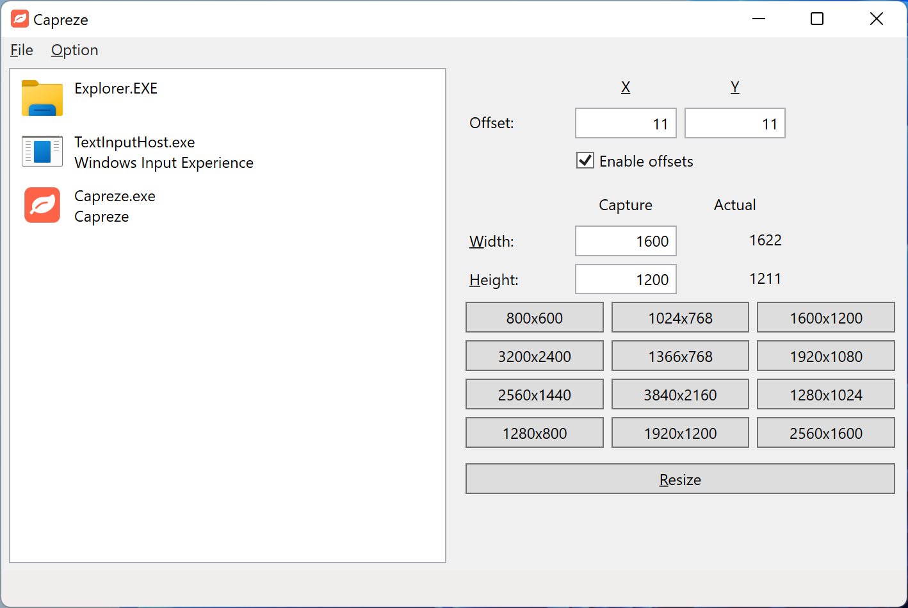

# Capreze

[View in English](README.md)

キャプチャに最適化されたウィンドウ サイズ変更ツール

## スクリーンショット

## 機能

- キャプチャのためにサイズを自動的に調整します
- 高 DPI スクリーンに対応しています
- プリセットされたサイズにより簡単にサイズの変更が可能です

## 依存関係

- [.NET Core 8.0](https://dotnet.microsoft.com/download/dotnet-core/8.0)
- [Microsoft.ApplicationInsights.WorkerService](https://www.nuget.org/packages/Microsoft.ApplicationInsights.WorkerService/2.22.0) (2.22.0)
- [Microsoft.Extensions.Configuration.Json](https://www.nuget.org/packages/Microsoft.Extensions.Configuration.Json/8.0.0) (8.0.0)
- [Microsoft.Extensions.DependencyInjection](https://www.nuget.org/packages/Microsoft.Extensions.DependencyInjection/8.0.0) (8.0.0)
- [Microsoft.Extensions.Hosting](https://www.nuget.org/packages/Microsoft.Extensions.Hosting/8.0.0) (8.0.0)
- [Microsoft.Xaml.Behaviors.Wpf](https://www.nuget.org/packages/Microsoft.Xaml.Behaviors.Wpf/1.1.122) (1.1.122)
- [System.Drawing.Common](https://www.nuget.org/packages/System.Drawing.Common/8.0.6) (8.0.6)
- [TinyMapper](https://www.nuget.org/packages/TinyMapper/3.0.3) (3.0.3)
