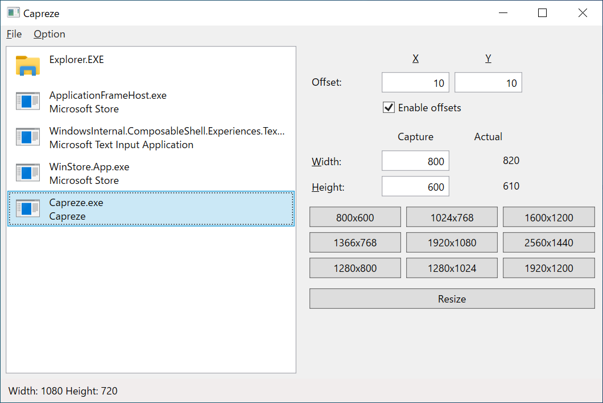

# Capreze

Window Resizing Tool for Capture

## Screenshot

## Features

- Automatically adjust to size for capture
- Supports high DPI screen
- Easily change the size by the preset size definition

## Dependencies

- [.NET Core 3.0](https://dotnet.microsoft.com/download/dotnet-core/3.0) (3.0.0-preview5)
- [Microsoft.AppCenter.Analytics](https://www.nuget.org/packages/Microsoft.AppCenter.Analytics/2.3.0-preview) (2.3.0-preview)
- [Microsoft.AppCenter.Crashes](https://www.nuget.org/packages/Microsoft.AppCenter.Crashes/2.3.0-preview) (2.3.0-preview)
- [Microsoft.Extensions.DependencyInjection](https://www.nuget.org/packages/Microsoft.Extensions.DependencyInjection/2.2.0) (2.2.0)
- [Microsoft.Xaml.Behaviors.Wpf](https://www.nuget.org/packages/Microsoft.Xaml.Behaviors.Wpf/1.0.1) (1.0.1)
- [Newtonsoft.Json](https://www.nuget.org/packages/Newtonsoft.Json/12.0.2) (12.0.2)
