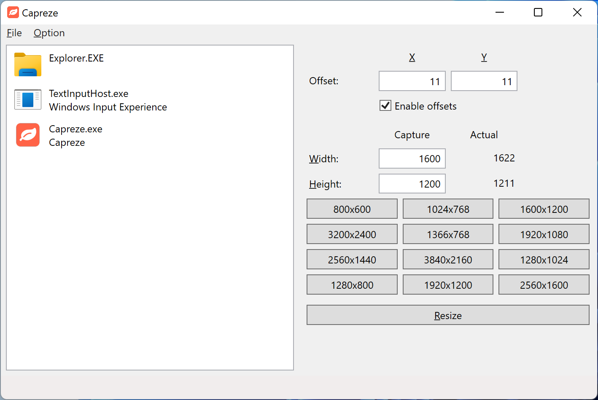

# Capreze

[日本語で見る](./README.ja-jp.md)

A window size auto-adjust tool for pixel-perfect captures

[](https://github.com/karamem0/capreze/actions/workflows/trigger-on-main.yml)
[](https://github.com/karamem0/capreze/blob/main/LICENSE)

## Screenshot



## Features

This tool automatically detects the difference (offset) between the displayed window size and the actual image size to improve capture accuracy, allowing you to capture at the exact specified size. In multi-monitor environments, corrections can be applied for each monitor on which the target window appears.

- Automatic detection of window and captured image border difference (offset)
- Multi-monitor support
- Assistance for precise size setting at exact pixel units

## How it works

Capreze automatically detects and corrects the discrepancy (hereafter "offset") between the visible window area and the pixel area actually obtained as a screenshot, adjusting the window size so that captures match the specified pixel dimensions.

On Windows 10 and later, Fluent UI shadows (drop shadows) and window borders are drawn, and screenshots taken by methods like Alt + PrintScreen or Snipping Tool often exclude shadows, resulting in captured images that are smaller than the visible window. DPI scaling also changes the width of shadows and borders, requiring different offsets.

Approximate known correction values are shown below.

|Scaling|Offset|
|--:|--:|
|100%|7px|
|125%|8px|
|150%|10px|
|200%|12px|

For example, to capture an 800×600px image at 150% scaling, consider an offset and set the window size to approximately 820×610px.

Capreze applies suitable corrections for each monitor in multi-monitor setups.

## Installation

### WinGet

Install the app via the command line.

```
winget install Capreze
```

### Vector

Download the installer from the page and install it manually.

[Download](https://www.vector.co.jp/soft/winnt/art/se524149.html)

## Dependencies

- [.NET 10.0](https://dotnet.microsoft.com/download/dotnet/10.0)
- [Microsoft.ApplicationInsights.WorkerService](https://www.nuget.org/packages/Microsoft.ApplicationInsights.WorkerService/2.23.0) (2.23.0)
- [Microsoft.Extensions.Configuration.Json](https://www.nuget.org/packages/Microsoft.Extensions.Configuration.Json/10.0.1) (10.0.1)
- [Microsoft.Extensions.DependencyInjection](https://www.nuget.org/packages/Microsoft.Extensions.DependencyInjection/10.0.1) (10.0.1)
- [Microsoft.Extensions.Hosting](https://www.nuget.org/packages/Microsoft.Extensions.Hosting/10.0.1) (10.0.1)
- [Microsoft.Xaml.Behaviors.Wpf](https://www.nuget.org/packages/Microsoft.Xaml.Behaviors.Wpf/1.1.135) (1.1.135)
- [TinyMapper](https://www.nuget.org/packages/TinyMapper/3.0.3) (3.0.3)
