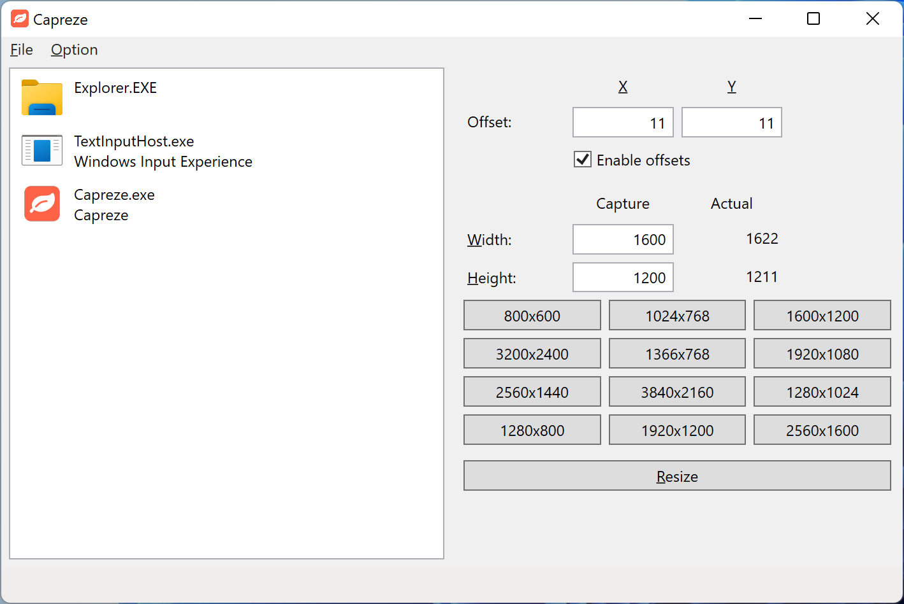

# Capreze

Window resizing tool for capturing

## Screenshot

## Features

- Automatically adjust to size for capturing
- Supports high DPI screen
- Easily change the size by the preset size definition

## Dependencies

- [.NET Core 5.0](https://dotnet.microsoft.com/download/dotnet-core/5.0)
- [Microsoft.ApplicationInsights.WorkerService](https://www.nuget.org/packages/Microsoft.ApplicationInsights.WorkerService/2.20.0) (2.20.0)
- [Microsoft.Extensions.Configuration.Json](https://www.nuget.org/packages/Microsoft.Extensions.Configuration.Json/5.0.0) (5.0.0)
- [Microsoft.Extensions.DependencyInjection](https://www.nuget.org/packages/Microsoft.Extensions.DependencyInjection/5.0.2) (5.0.2)
- [Microsoft.Extensions.Hosting](https://www.nuget.org/packages/Microsoft.Extensions.Hosting/5.0.0) (5.0.0)
- [Microsoft.Xaml.Behaviors.Wpf](https://www.nuget.org/packages/Microsoft.Xaml.Behaviors.Wpf/1.1.31) (1.1.31)
- [System.Drawing.Common](https://www.nuget.org/packages/System.Drawing.Common/5.0.2) (5.0.2)
